# Teaching-HEIGVD-SRX-2022-Laboratoire-Snort

**Ce travail de laboratoire est à faire en équipes de 2 personnes**

**ATTENTION : Commencez par créer un Fork de ce repo et travaillez sur votre fork.**

Clonez le repo sur votre machine. Vous pouvez répondre aux questions en modifiant directement votre clone du README.md ou avec un fichier pdf que vous pourrez uploader sur votre fork.

**Le rendu consiste simplement à répondre à toutes les questions clairement identifiées dans le texte avec la mention "Question" et à les accompagner avec des captures. Le rendu doit se faire par une "pull request". Envoyer également le hash du dernier commit et votre username GitHub par email au professeur et à l'assistant**

## Table de matières

[Introduction](#introduction)

[Echéance](#echéance)

[Démarrage de l'environnement virtuel](#démarrage-de-lenvironnement-virtuel)

[Communication avec les conteneurs](#communication-avec-les-conteneurs)

[Configuration de la machine IDS et installation de Snort](#configuration-de-la-machine-ids-et-installation-de-snort)

[Essayer Snort](#essayer-snort)

[Utilisation comme IDS](#utilisation-comme-un-ids)

[Ecriture de règles](#ecriture-de-règles)

[Travail à effectuer](#exercises)

[Cleanup](#cleanup)


## Echéance

Ce travail devra être rendu au plus tard, **le 29 avril 2022 à 08h30.**


## Introduction

Dans ce travail de laboratoire, vous allez explorer un système de détection contre les intrusions (IDS) dont l'utilisation es très répandue grâce au fait qu'il est gratuit et open source. Il s'appelle [Snort](https://www.snort.org). Il existe des versions de Snort pour Linux et pour Windows.

### Les systèmes de détection d'intrusion

Un IDS peut "écouter" tout le traffic de la partie du réseau où il est installé. Sur la base d'une liste de règles, il déclenche des actions sur des paquets qui correspondent à la description de la règle.

Un exemple de règle pourrait être, en langage commun : "donner une alerte pour tous les paquets envoyés par le port http à un serveur web dans le réseau, qui contiennent le string 'cmd.exe'". En on peut trouver des règles très similaires dans les règles par défaut de Snort. Elles permettent de détecter, par exemple, si un attaquant essaie d'éxecuter un shell de commandes sur un serveur Web tournant sur Windows. On verra plus tard à quoi ressemblent ces règles.

Snort est un IDS très puissant. Il est gratuit pour l'utilisation personnelle et en entreprise, où il est très utilisé aussi pour la simple raison qu'il est l'un des systèmes IDS des plus efficaces.

Snort peut être exécuté comme un logiciel indépendant sur une machine ou comme un service qui tourne après chaque démarrage. Si vous voulez qu'il protège votre réseau, fonctionnant comme un IPS, il faudra l'installer "in-line" avec votre connexion Internet.

Par exemple, pour une petite entreprise avec un accès Internet avec un modem simple et un switch interconnectant une dizaine d'ordinateurs de bureau, il faudra utiliser une nouvelle machine éxecutant Snort et placée entre le modem et le switch.


## Matériel

Vous avez besoin de votre ordinateur avec Docker et docker-compose. Vous trouverez tous les fichiers nécessaires pour générer l'environnement pour virtualiser ce labo dans le projet que vous avez cloné.


## Démarrage de l'environnement virtuel

Ce laboratoire utilise docker-compose, un outil pour la gestion d'applications utilisant multiples conteneurs. Il va se charger de créer un réseaux virtuel `snortlan`, la machine IDS, un client avec un navigateur Firefox, une machine "Client" et un conteneur Wireshark directement connecté à la même interface réseau que la machine IDS. Le réseau LAN interconnecte les autres 3 machines (voir schéma ci-dessous).


Nous allons commencer par lancer docker-compose. Il suffit de taper la commande suivante dans le répertoire racine du labo, celui qui contient le fichier [docker-compose.yml](docker-compose.yml). Optionnelement vous pouvez lancer le script [up.sh](scripts/up.sh) qui se trouve dans le répertoire [scripts](scripts), ainsi que d'autres scripts utiles pour vous :

```bash
docker-compose up --detach
```

Le téléchargement et génération des images prend peu de temps.

Les images utilisées pour les conteneurs client et la machine IDS sont basées sur l'image officielle Kali. Le fichier [Dockerfile](Dockerfile) que vous avez téléchargé contient les informations nécessaires pour la génération de l'image de base. [docker-compose.yml](docker-compose.yml) l'utilise comme un modèle pour générer ces conteneurs. Les autres deux conteneurs utilisent des images du groupe LinuxServer.io. Vous pouvez vérifier que les quatre conteneurs sont crées et qu'ils fonctionnent à l'aide de la commande suivante.

```bash
docker ps
```

## Communication avec les conteneurs

Afin de simplifier vos manipulations, les conteneurs ont été configurées avec les noms suivants :

- IDS
- Client
- wireshark
- firefox

Pour accéder au terminal de l’une des machines, il suffit de taper :

```bash
docker exec -it <nom_de_la_machine> /bin/bash
```

Par exemple, pour ouvrir un terminal sur votre IDS :

```bash
docker exec -it IDS /bin/bash
```

Optionnelement, vous pouvez utiliser les scripts [openids.sh](scripts/openids.sh), [openfirefox.sh](scripts/openfirefox.sh) et [openclient.sh](scripts/openclient.sh) pour contacter les conteneurs.

Vous pouvez bien évidemment lancer des terminaux communiquant avec toutes les machines en même temps ou même lancer plusieurs terminaux sur la même machine. ***Il est en fait conseillé pour ce laboratoire de garder au moins deux terminaux ouverts sur la machine IDS en tout moment***.


### Configuration de la machine Client et de firefox

Dans un terminal de votre machine Client et de la machine firefox, taper les commandes suivantes :

```bash
ip route del default
ip route add default via 192.168.220.2
```

Ceci configure la machine IDS comme la passerelle par défaut pour les deux autres machines.


## Configuration de la machine IDS et installation de Snort

Pour permettre à votre machine Client de contacter l'Internet à travers la machine IDS, il faut juste une petite règle NAT par intermédiaire de nftables :

```bash
nft add table nat
nft 'add chain nat postrouting { type nat hook postrouting priority 100 ; }'
nft add rule nat postrouting meta oifname "eth0" masquerade
```

Cette commande `iptables` définit une règle dans le tableau NAT qui permet la redirection de ports et donc, l'accès à l'Internet pour la machine Client.

On va maintenant installer Snort sur le conteneur IDS.

La manière la plus simple c'est d'installer Snort en ligne de commandes. Il suffit d'utiliser la commande suivante :

```
apt update && apt install snort
```

Ceci télécharge et installe la version la plus récente de Snort.

Il est possible que vers la fin de l'installation, on vous demande de fournir deux informations :

- Le nom de l'interface sur laquelle snort doit surveiller - il faudra répondre ```eth0```
- L'adresse de votre réseau HOME. Il s'agit du réseau que vous voulez protéger. Cela sert à configurer certaines variables pour Snort. Vous pouvez répondre ```192.168.220.0/24```.


## Essayer Snort

Une fois installé, vous pouvez lancer Snort comme un simple "sniffer". Pourtant, ceci capture tous les paquets, ce qui peut produire des fichiers de capture énormes si vous demandez de les journaliser. Il est beaucoup plus efficace d'utiliser des règles pour définir quel type de trafic est intéressant et laisser Snort ignorer le reste.

Snort se comporte de différentes manières en fonction des options que vous passez en ligne de commande au démarrage. Vous pouvez voir la grande liste d'options avec la commande suivante :

```
snort --help
```

On va commencer par observer tout simplement les entêtes des paquets IP utilisant la commande :

```
snort -v -i eth0
```

**ATTENTION : le choix de l'interface devient important si vous avez une machine avec plusieurs interfaces réseau. Dans notre cas, vous pouvez ignorer entièrement l'option ```-i eth0```et cela devrait quand-même fonctionner correctement.**

Snort s'éxecute donc et montre sur l'écran tous les entêtes des paquets IP qui traversent l'interface eth0. Cette interface reçoit tout le trafic en provenance de la machine "Client" puisque nous avons configuré le IDS comme la passerelle par défaut.

Pour arrêter Snort, il suffit d'utiliser `CTRL-C` (**attention** : en ligne générale, ceci fonctionne si vous patientez un moment... Snort est occupé en train de gérer le contenu du tampon de communication et cela qui peut durer quelques secondes. Cependant, il peut arriver de temps à autres que Snort ne réponde plus correctement au signal d'arrêt. Dans ce cas-là, il faudra utiliser `kill` depuis un deuxième terminal pour arrêter le process).


## Utilisation comme un IDS

Pour enregistrer seulement les alertes et pas tout le trafic, on execute Snort en mode IDS. Il faudra donc spécifier un fichier contenant des règles.

Il faut noter que `/etc/snort/snort.config` contient déjà des références aux fichiers de règles disponibles avec l'installation par défaut. Si on veut tester Snort avec des règles simples, on peut créer un fichier de config personnalisé (par exemple `mysnort.conf`) et importer un seul fichier de règles utilisant la directive "include".

Les fichiers de règles sont normalement stockes dans le répertoire `/etc/snort/rules/`, mais en fait un fichier de config et les fichiers de règles peuvent se trouver dans n'importe quel répertoire de la machine.

Par exemple, créez un fichier de config `mysnort.conf` dans le repertoire `/etc/snort` avec le contenu suivant :

```
include /etc/snort/rules/icmp2.rules
```

Ensuite, créez le fichier de règles `icmp2.rules` dans le repertoire `/etc/snort/rules/` et rajoutez dans ce fichier le contenu suivant :

`alert icmp any any -> any any (msg:"ICMP Packet"; sid:4000001; rev:3;)`

On peut maintenant éxecuter la commande :

```
snort -c /etc/snort/mysnort.conf
```

Vous pouvez maintenant faire quelques pings depuis votre "Client" et regarder les résultas dans le fichier d'alertes contenu dans le repertoire `/var/log/snort/`.


## Ecriture de règles

Snort permet l'écriture de règles qui décrivent des tentatives de exploitation de vulnérabilités bien connues. Les règles Snort prennent en charge à la fois, l'analyse de protocoles et la recherche et identification de contenu.

Il y a deux principes de base à respecter :

* Une règle doit être entièrement contenue dans une seule ligne
* Les règles sont divisées en deux sections logiques : (1) l'entête et (2) les options.

L'entête de la règle contient l'action de la règle, le protocole, les adresses source et destination, et les ports source et destination.

L'option contient des messages d'alerte et de l'information concernant les parties du paquet dont le contenu doit être analysé. Par exemple:

```
alert tcp any any -> 192.168.220.0/24 111 (content:"|00 01 86 a5|"; msg: "mountd access";)
```

Cette règle décrit une alerte générée quand Snort trouve un paquet avec tous les attributs suivants :

* C'est un paquet TCP
* Emis depuis n'importe quelle adresse et depuis n'importe quel port
* A destination du réseau identifié par l'adresse 192.168.220.0/24 sur le port 111

Le text jusqu'au premier parenthèse est l'entête de la règle.

```
alert tcp any any -> 192.168.220.0/24 111
```

Les parties entre parenthèses sont les options de la règle:

```
(content:"|00 01 86 a5|"; msg: "mountd access";)
```

Les options peuvent apparaître une ou plusieurs fois. Par exemple :

```
alert tcp any any -> any 21 (content:"site exec"; content:"%"; msg:"site
exec buffer overflow attempt";)
```

La clé "content" apparait deux fois parce que les deux strings qui doivent être détectés n'apparaissent pas concaténés dans le paquet mais a des endroits différents. Pour que la règle soit déclenchée, il faut que le paquet contienne **les deux strings** "site exec" et "%".

Les éléments dans les options d'une règle sont traités comme un AND logique. La liste complète de règles sont traitées comme une succession de OR.

## Informations de base pour le règles

### Actions :

```
alert tcp any any -> any any (msg:"My Name!"; content:"Skon"; sid:1000001; rev:1;)
```

L'entête contient l'information qui décrit le "qui", le "où" et le "quoi" du paquet. Ça décrit aussi ce qui doit arriver quand un paquet correspond à tous les contenus dans la règle.

Le premier champ dans le règle c'est l'action. L'action dit à Snort ce qui doit être fait quand il trouve un paquet qui correspond à la règle. Il y a six actions :

* alert - générer une alerte et écrire le paquet dans le journal
* log - écrire le paquet dans le journal
* pass - ignorer le paquet
* drop - bloquer le paquet et l'ajouter au journal
* reject - bloquer le paquet, l'ajouter au journal et envoyer un `TCP reset` si le protocole est TCP ou un `ICMP port unreachable` si le protocole est UDP
* sdrop - bloquer le paquet sans écriture dans le journal

### Protocoles :

Le champ suivant c'est le protocole. Il y a trois protocoles IP qui peuvent être analysés par Snort : TCP, UDP et ICMP.


### Adresses IP :

La section suivante traite les adresses IP et les numéros de port. Le mot `any` peut être utilisé pour définir "n'import quelle adresse". On peut utiliser l'adresse d'une seule machine ou un block avec la notation CIDR.

Un opérateur de négation peut être appliqué aux adresses IP. Cet opérateur indique à Snort d'identifier toutes les adresses IP sauf celle indiquée. L'opérateur de négation est le `!`.

Par exemple, la règle du premier exemple peut être modifiée pour alerter pour le trafic dont l'origine est à l'extérieur du réseau :

```
alert tcp !192.168.220.0/24 any -> 192.168.220.0/24 111
(content: "|00 01 86 a5|"; msg: "external mountd access";)
```

### Numéros de Port :

Les ports peuvent être spécifiés de différentes manières, y-compris `any`, une définition numérique unique, une plage de ports ou une négation.

Les plages de ports utilisent l'opérateur `:`, qui peut être utilisé de différentes manières aussi :

```
log udp any any -> 192.168.220.0/24 1:1024
```

Journaliser le traffic UDP venant d'un port compris entre 1 et 1024.

--

```
log tcp any any -> 192.168.220.0/24 :6000
```

Journaliser le traffic TCP venant d'un port plus bas ou égal à 6000.

--

```
log tcp any :1024 -> 192.168.220.0/24 500:
```

Journaliser le traffic TCP venant d'un port privilégié (bien connu) plus grand ou égal à 500 mais jusqu'au port 1024.


### Opérateur de direction

L'opérateur de direction `->`indique l'orientation ou la "direction" du trafique.

Il y a aussi un opérateur bidirectionnel, indiqué avec le symbole `<>`, utile pour analyser les deux côtés de la conversation. Par exemple un échange telnet :

```
log 192.168.220.0/24 any <> 192.168.220.0/24 23
```

## Alertes et logs Snort

Si Snort détecte un paquet qui correspond à une règle, il envoie un message d'alerte ou il journalise le message. Les alertes peuvent être envoyées au syslog, journalisées dans un fichier text d'alertes ou affichées directement à l'écran.

Le système envoie **les alertes vers le syslog** et il peut en option envoyer **les paquets "offensifs" vers une structure de repertoires**.

Les alertes sont journalisées via syslog dans le fichier `/var/log/snort/alerts`. Toute alerte se trouvant dans ce fichier aura son paquet correspondant dans le même repertoire, mais sous le fichier `snort.log.xxxxxxxxxx` où `xxxxxxxxxx` est l'heure Unix du commencement du journal.

Avec la règle suivante :

```
alert tcp any any -> 192.168.220.0/24 111
(content:"|00 01 86 a5|"; msg: "mountd access";)
```

un message d'alerte est envoyé à syslog avec l'information "mountd access". Ce message est enregistré dans `/var/log/snort/alerts` et le vrai paquet responsable de l'alerte se trouvera dans un fichier dont le nom sera `/var/log/snort/snort.log.xxxxxxxxxx`.

Les fichiers log sont des fichiers binaires enregistrés en format pcap. Vous pouvez les ouvrir avec Wireshark ou les diriger directement sur la console avec la commande suivante :

```
tcpdump -r /var/log/snort/snort.log.xxxxxxxxxx
```

Vous pouvez aussi utiliser des captures Wireshark ou des fichiers snort.log.xxxxxxxxx comme source d'analyse por Snort.

## Exercises

**Réaliser des captures d'écran des exercices suivants et les ajouter à vos réponses.**

### Essayer de répondre à ces questions en quelques mots, en réalisant des recherches sur Internet quand nécessaire :

**Question 1: Qu'est ce que signifie les "preprocesseurs" dans le contexte de Snort ?**

---

**Réponse :**

Snort possède plusieurs composants autres que le moteur de règles.\
Par exemple, certains paquets et applications doivent être décodés en texte clair pour que les règles Snort se déclenchent.\
Le composant qui traite les paquets avant qu'ils n'atteignent le moteur de règles s'appelle le préprocesseur.

Les préprocesseurs permettent d'étendre les fonctionnalités de Snort en permettant aux utilisateurs et aux programmeurs d'y intégrer assez facilement des plugins modulaires.\
Le code du préprocesseur est exécuté avant que le moteur de détection ne soit appelé, mais après que le paquet ait été décodé.\
Grâce à ce mécanisme, le paquet peut être modifié ou analysé de manière hors bande. 

Informations tirées du [manuel](http://manual-snort-org.s3-website-us-east-1.amazonaws.com/node17.html)

---

**Question 2: Pourquoi êtes vous confronté au WARNING suivant `"No preprocessors configured for policy 0"` lorsque vous exécutez la commande `snort` avec un fichier de règles ou de configuration "fait-maison" ?**

---

**Réponse :**

C'est parce qu'aucun préprocesseur snort n'est chargé dans notre fichier de règle.\
Par exemple, dans le fichier de base `snort.conf`, on peut y retrouver des configurations de préprocesseur telles que :
- preprocessor normalize_ip4
- preprocessor normalize_icmp4
- preprocessor frag3_global: max_frags 65536
- preprocessor ftp_telnet: global inspection_type stateful encrypted_traffic no check_encrypted

C'est pour ça que, si on charge ce fichier de configuration plutôt que le nôtre, nous n'avons plus le warning.

---

--

### Trouver du contenu :

Considérer la règle simple suivante:

alert tcp any any -> any any (msg:"Mon nom!"; content:"Rubinstein"; sid:4000015; rev:1;)

**Question 3: Qu'est-ce qu'elle fait la règle et comment ça fonctionne ?**

---

**Réponse :**

Cette ligne va envoyer une alerte et écrire dans le journal le message "Mon nom!"\
si le mot "Rubinstein" est trouvé dans un paquet TCP envoyé par n'importe qui vers n'importe où.\
L'id de cette règle est le 4000015 et c'est la première révision de cette règle.

---

Utiliser nano pour créer un fichier `myrules.rules` sur votre répertoire home (```/root```). Rajouter une règle comme celle montrée avant mais avec votre text, phrase ou mot clé que vous aimeriez détecter. Lancer Snort avec la commande suivante :

```
sudo snort -c myrules.rules -i eth0
```

**Question 4: Que voyez-vous quand le logiciel est lancé ? Qu'est-ce que tous ces messages affichés veulent dire ?**

---

**Réponse :**  

C'est un résumé des règles trouvées, des préprocesseurs configurés, des ports pris en considération par les règles,\
le nombre des différents protocoles analysés par les règles comme tcp, udp, ou icmp, etc...

De plus, il y a également l'interface qui est analysée (ici eth0).

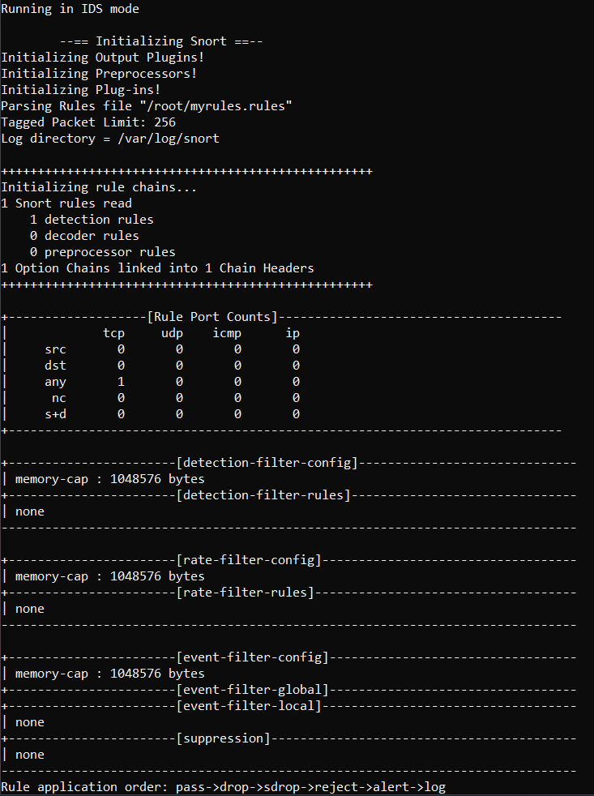

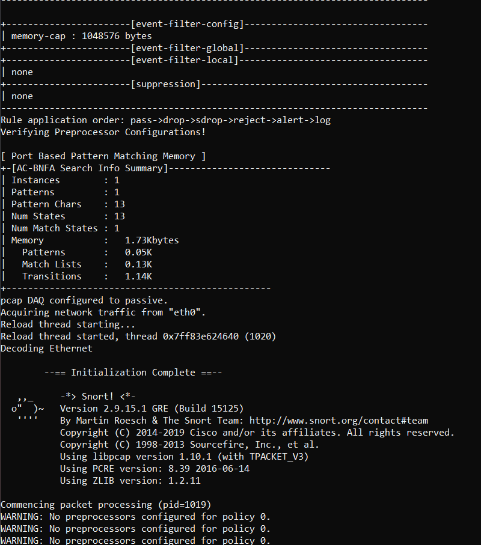

---

Aller à un site web contenant dans son text la phrase ou le mot clé que vous avez choisi (il faudra chercher un peu pour trouver un site en http... Si vous n'y arrivez pas, vous pouvez utiliser [http://neverssl.com](http://neverssl.com) et modifier votre votre règle pour détecter un morceau de text contenu dans le site).

Pour accéder à Firefox dans son conteneur, ouvrez votre navigateur web sur votre machine hôte et dirigez-le vers [http://localhost:4000](http://localhost:4000). Optionnellement, vous pouvez utiliser wget sur la machine client pour lancer la requête http ou le navigateur Web lynx - il suffit de taper ```lynx neverssl.com```. Le navigateur lynx est un navigateur basé sur text, sans interface graphique.

**Question 5: Que voyez-vous sur votre terminal quand vous chargez le site depuis Firefox ou la machine Client ?**

---

**Réponse :**

Une série de warnings qui indiquent qu'aucun préprocesseur n'a été configuré.
Cependant, les alertes sont bel et bien enregistré dans les fichiers de logs.

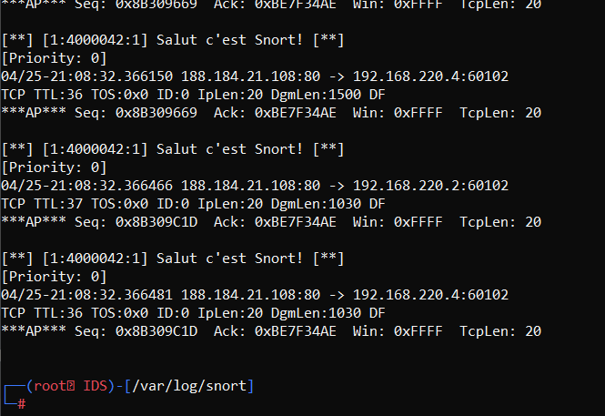

---

Arrêter Snort avec `CTRL-C`.

**Question 6: Que voyez-vous quand vous arrêtez snort ? Décrivez en détail toutes les informations qu'il vous fournit.**

---

**Réponse :**  

De nouveau un résumé, mais cette fois-ci de combien de paquets ont eu une correspondance\
avec les règles de Snort, de combien de temps l'IDS est lancé, de quel protocole venait\
les paquets qui ont été récupérés, etc...

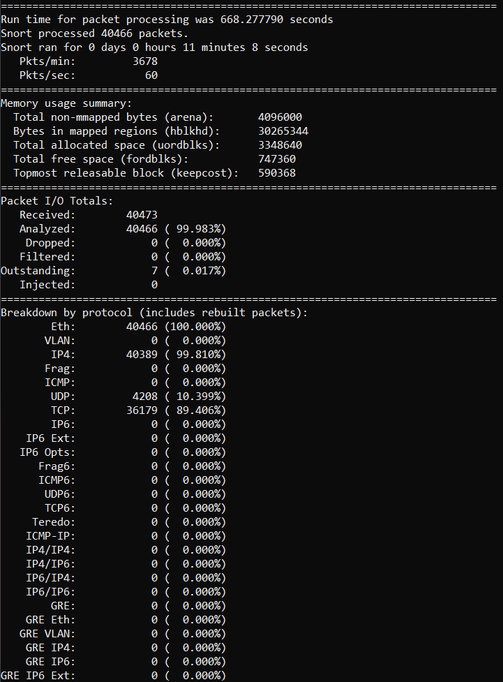

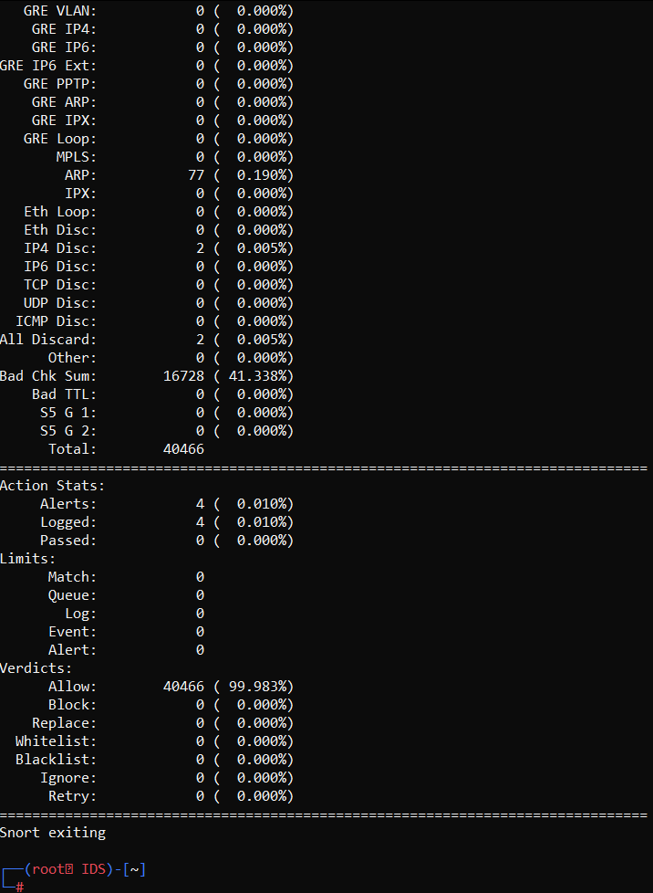

---


Aller au répertoire /var/log/snort. Ouvrir le fichier `alert`. Vérifier qu'il y ait des alertes pour votre texte choisi.

**Question 7: A quoi ressemble l'alerte ? Qu'est-ce que chaque élément de l'alerte veut dire ? Décrivez-la en détail !**

---

**Réponse :**  

La règle écrite est la suivante : `alert tcp any any -> any any (msg:"Salut c'est Snort!"; content:"WorldWideWeb"; sid:4000042; rev:1;)`

Et voici une des alertes obtenues :

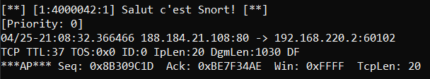

On peut clairement voir le message qui s'affiche, mais également l'id de la règle ayant\
détecté le paquet, la priorité de cette règle, en somme, tous ce qui peut servir pour reconnaître la règle utilisée.

De plus, il y a également des informations sur l'heure et la date où cette alerte a été écrite,\
ainsi que le protocole du paquet intercepté, son port, l'adresse IP source, celle de destination, etc...

Et pour finir, une série d'information sur l'"apparence" du paquet, c'est-à-dire sa taille, sa séquence, le numéro de Ack, etc...

---


--

### Detecter une visite à Wikipedia

Ecrire deux règles qui journalisent (sans alerter) chacune un message à chaque fois que Wikipedia est visité **SPECIFIQUEMENT DEPUIS VOTRE MACHINE CLIENT OU DEPUIS FIREFOX**. Chaque règle doit identifier quelle machine à réalisé la visite. Ne pas utiliser une règle qui détecte un string ou du contenu. Il faudra se baser sur d'autres paramètres.

**Question 8: Quelle est votre règle ? Où le message a-t'il été journalisé ? Qu'est-ce qui a été journalisé ?**

---

**Réponse :** 
 
```Shell
portvar Http [80,443]
ipvar Wiki 91.198.174.192

log tcp 192.168.220.3 any -> $Wiki $Http (msg:"Le client veut aller sur Wikipedia"; content:"wikipedia"; nocase; sid:4000024; rev:1;)
log tcp 192.168.220.4 any -> $Wiki $Http (msg:"Firefox veut aller sur Wikipedia"; content:"wikipedia"; nocase; sid:4000059; rev:1;)
```
Les logs sont inscrits sous `var/log/snort/snort.log.XXXXXXXXXXX`

On peut les voir avec `tcpdump -r snort.log.XXXXXXXXXXX`

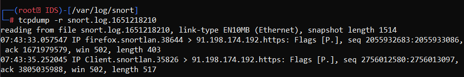

---

--

### Détecter un ping d'un autre système

Ecrire une règle qui alerte à chaque fois que votre machine IDS **reçoit** un ping depuis une autre machine (n'import laquelle des autres machines de votre réseau). Assurez-vous que **ça n'alerte pas** quand c'est vous qui **envoyez** le ping depuis l'IDS vers un autre système !

**Question 9: Quelle est votre règle ?**

---

**Réponse :**  

`alert icmp 192.168.220.0/24 any -> 192.168.220.2 any (msg:"Paquet ICMP vers IDS"; itype:8; sid:4000011; rev:1;)`


---


**Question 10: Comment avez-vous fait pour que ça identifie seulement les pings entrants ?**

---

**Réponse :**  

La règle tient compte uniquement des pings venant du réseau 192.168.220.0/24 comme IP source, et en direction de l'IDS uniquement.\
Par ailleurs, il y a également l'option `iptype:8` pour spécifier le type *ECHO Request* de la requête *ICMP*.

---


**Question 11: Où le message a-t-il été journalisé ?**

---

**Réponse :**  

Dans le fichier `/var/log/snort/alert` qu'on peut afficher avec un simple `cat`. (Il y a également l'information dans les logs sous `/var/log/snort/snort.log.XXXXXXXXXXX`)

---

Les journaux sont générés en format pcap. Vous pouvez donc les lire avec Wireshark. Vous pouvez utiliser le conteneur wireshark en dirigeant le navigateur Web de votre hôte sur [http://localhost:3000](http://localhost:3000). Optionnellement, vous pouvez lire les fichiers log utilisant la commande `tshark -r nom_fichier_log` depuis votre IDS.

**Question 12: Qu'est-ce qui a été journalisé ?**

---

**Réponse :**  

Voici ce qui a été journalisé en utilisant `tshark -r snort.log.XXXXXXXXXXX` :

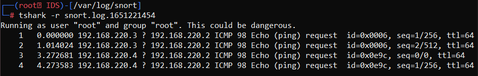

---

--

### Detecter les ping dans les deux sens

Faites le nécessaire pour que les pings soient détectés dans les deux sens.

**Question 13: Qu'est-ce que vous avez fait pour détecter maintenant le trafic dans les deux sens ?**

---

**Réponse :**  

Cela revient au même que la précedente commande, on remplace juste `->` par `<>`.\
`alert icmp 192.168.220.0/24 any <> 192.168.220.2 any (msg:"Paquet ICMP depuis/vers IDS"; itype:8; sid:4000011; rev:1;)`

---


--

### Detecter une tentative de login SSH

Essayer d'écrire une règle qui Alerte qu'une tentative de session SSH a été faite depuis la machine Client sur l'IDS.

**Question 14: Quelle est votre règle ? Montrer la règle et expliquer en détail comment elle fonctionne.**

---

**Réponse :**  

```Shell
ipvar $IDS 192.168.220.2
ipvar $Client 192.168.220.3

alert tcp $Client any -> $IDS 22 (msg:"Tentative de SSH du client vers IDS"; sid:4000005; rev:1;)
```

La règle provoque une alerte dès que l'IP correpondant à celle du client essaie d'accéder au port 22 (port SSH) de l'adresse IP de la machine IDS.
Cela provoque une alerte dans tous les cas, que la requête SSH ait abouti ou ait été refusée/droppée.

---


**Question 15: Montrer le message enregistré dans le fichier d'alertes.**

---

**Réponse :** 

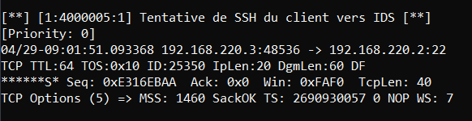

---

--

### Analyse de logs

Depuis l'IDS, servez-vous de l'outil ```tshark```pour capturer du trafic dans un fichier. ```tshark``` est une version en ligne de commandes de ```Wireshark```, sans interface graphique.

Pour lancer une capture dans un fichier, utiliser la commande suivante :

```
tshark -w nom_fichier.pcap
```

Générez du trafic depuis le deuxième terminal qui corresponde à l'une des règles que vous avez ajoutées à votre fichier de configuration personnel. Arrêtez la capture avec ```Ctrl-C```.

**Question 16: Quelle est l'option de Snort qui permet d'analyser un fichier pcap ou un fichier log ?**

---

**Réponse :**  

Il faut utiliser l'option `-r`, par exemple `snort -r mon_fichier.pcap` ou `snort -r mon_fichier.log`

---

Utiliser l'option correcte de Snort pour analyser le fichier de capture Wireshark que vous venez de générer.

**Question 17: Quelle est le comportement de Snort avec un fichier de capture ? Y-a-t'il une différence par rapport à l'analyse en temps réel ?**

---

**Réponse :**  

Après l'entête de Snort (qui a les mêmes infos que celle avec le temps réel), tous les paquets avec les informations sont affichés,\
séparé par une ligne `=+=+=+=+=+=+=+=+=+=+=+=+=+=+=+=+=+=+=+=+=+=+=+=+=+=+=+=+=+=+=+=+=+=+=+=+=+`.

Voici un exemple où on peut observer la demande de connexion SSH :
```Shell
=+=+=+=+=+=+=+=+=+=+=+=+=+=+=+=+=+=+=+=+=+=+=+=+=+=+=+=+=+=+=+=+=+=+=+=+=+

04/29-09:14:25.327006 192.168.220.2:3000 -> 192.168.220.1:63508
TCP TTL:64 TOS:0x0 ID:11701 IpLen:20 DgmLen:52 DF
***A**** Seq: 0x46E04DE8  Ack: 0xEA2820AA  Win: 0x1F5  TcpLen: 32
TCP Options (3) => NOP NOP TS: 3938241695 2403371491
=+=+=+=+=+=+=+=+=+=+=+=+=+=+=+=+=+=+=+=+=+=+=+=+=+=+=+=+=+=+=+=+=+=+=+=+=+

04/29-09:14:25.391273 192.168.220.3:48620 -> 192.168.220.2:22
TCP TTL:64 TOS:0x10 ID:3857 IpLen:20 DgmLen:60 DF
******S* Seq: 0x4A15024C  Ack: 0x0  Win: 0xFAF0  TcpLen: 40
TCP Options (5) => MSS: 1460 SackOK TS: 2691684354 0 NOP WS: 7
=+=+=+=+=+=+=+=+=+=+=+=+=+=+=+=+=+=+=+=+=+=+=+=+=+=+=+=+=+=+=+=+=+=+=+=+=+

WARNING: No preprocessors configured for policy 0.
04/29-09:14:25.391301 192.168.220.2:22 -> 192.168.220.3:48620
TCP TTL:64 TOS:0x10 ID:0 IpLen:20 DgmLen:40 DF
***A*R** Seq: 0x0  Ack: 0x4A15024D  Win: 0x0  TcpLen: 20
=+=+=+=+=+=+=+=+=+=+=+=+=+=+=+=+=+=+=+=+=+=+=+=+=+=+=+=+=+=+=+=+=+=+=+=+=+

WARNING: No preprocessors configured for policy 0.
WARNING: No preprocessors configured for policy 0.
WARNING: No preprocessors configured for policy 0.
WARNING: No preprocessors configured for policy 0.
04/29-09:14:25.571369 192.168.220.2:3000 -> 192.168.220.1:63508
TCP TTL:64 TOS:0x0 ID:11702 IpLen:20 DgmLen:78 DF
***AP*** Seq: 0x46E04DE8  Ack: 0xEA2820AA  Win: 0x1F5  TcpLen: 32
TCP Options (3) => NOP NOP TS: 3938241939 2403371491
=+=+=+=+=+=+=+=+=+=+=+=+=+=+=+=+=+=+=+=+=+=+=+=+=+=+=+=+=+=+=+=+=+=+=+=+=+
```

Et pour finir, il y a les mêmes informations de fin que la version en temps réel.

---

**Question 18: Est-ce que des alertes sont aussi enregistrées dans le fichier d'alertes?**

---

**Réponse :**  

Non, en utilisant un `-r`, les alertes et les logs ne sont pas journalisés.

---

--

### Contournement de la détection

Faire des recherches à propos des outils `fragroute` et `fragrouter`.

**Question 19: A quoi servent ces deux outils ?**

---

**Réponse :** 

- **fragroute** : Permet l'interception, l'édition, puis le renvoi du traffic de sortie destiné à un hôte.

Source : https://kalilinuxtutorials.com/fragroute/

- **fragrouter** : Kit d'outils pour la détection des intrusions dans les réseaux.

Source : https://www.kali.org/tools/fragrouter/

Ces deux outils sont très utiles afin d'effectuer des attaques discrètement sur un réseau avec des détecteurs d'instrusion.

---


**Question 20: Quel est le principe de fonctionnement ?**

---

**Réponse :**  

Fragroute possède un ensemble de règles simples pour le délai de routage, la réplication, le rejet, la fragmentation, etc... sur tous les paquets sortants destinés à l'hôte de destination.\
Un comportement aléatoire ou stochastique est pris en charge.

Fragrouter est une sorte de routeur de fragmentation unidirectionnel.\
Les paquets IP sont envoyés par l'attaquant à Fragrouter, qui les traduit en un flux de données fragmenté pour finalement être transmis à la victime.

---


**Question 21: Qu'est-ce que le `Frag3 Preprocessor` ? A quoi ça sert et comment ça fonctionne ?**

---

**Réponse :**  
Le préprocesseur frag3 est un module de défragmentation IP basé sur les cibles pour Snort. Frag3 est conçu avec les objectifs suivants :

1) Une exécution plus rapide avec une gestion des données moins complexe.
2) Techniques anti-évasion de modélisation de l'hôte basées sur la cible.

Frag3 utilise la structure de données sfxhash et des listes liées pour la gestion des données en interne, ce qui lui permet d'avoir des performances beaucoup plus prévisibles et déterministes dans n'importe quel environnement ce qui devrait nous aider à gérer les environnements fortement fragmentés.

Source : https://www.snort.org/faq/readme-frag3

---


L'utilisation des outils ```Fragroute``` et ```Fragrouter``` nécessite une infrastructure un peu plus complexe. On va donc utiliser autre chose pour essayer de contourner la détection.

L'outil nmap propose une option qui fragmente les messages afin d'essayer de contourner la détection des IDS. Générez une règle qui détecte un SYN scan sur le port 22 de votre IDS.


**Question 22: A quoi ressemble la règle que vous avez configurée ?**

---

**Réponse :**  

`alert tcp any any -> 192.168.220.2 22 (flags:S; msg:"Tentative de SSH vers IDS"; sid:4000006; rev:1;)`

---


Ensuite, servez-vous du logiciel nmap pour lancer un SYN scan sur le port 22 depuis la machine Client :

```
nmap -sS -p 22 192.168.220.2
```
Vérifiez que votre règle fonctionne correctement pour détecter cette tentative.

Ensuite, modifiez votre commande nmap pour fragmenter l'attaque :

```
nmap -sS -f -p 22 --send-eth 192.168.220.2
```

**Question 23: Quel est le résultat de votre tentative ?**

---

**Réponse :**  

En utilisant le scan normal, la règle a bien fonctionnée :

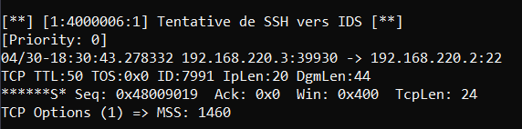

Cependant, avec la deuxième commande, en fragmentant le paquet, _Snort_ n'a rien reporté, **il n'y a aucune alerte**.

---


Modifier le fichier `myrules.rules` pour que snort utiliser le `Frag3 Preprocessor` et refaire la tentative.


**Question 24: Quel est le résultat ?**

---

**Réponse :**  

En rajoutant les lignes :
```Shell
preprocessor frag3_global
preprocessor frag3_engine
```

Le scan apparait finalement dans les alertes :

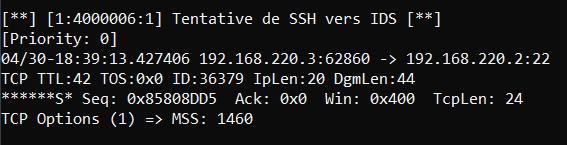

---


**Question 25: A quoi sert le `SSL/TLS Preprocessor` ?**

---

**Réponse :**  

Le trafic chiffré est ignoré par défaut par _Snort_ pour des raisons de performances et pour réduire les faux positifs.\
Ce pré-processeur permet d'inspecter le trafic SSL/TLS.

Par ailleurs, chaque paquet contenant du trafic SSL comporte une partie non-chiffrée qui fournit certaines informations sur le trafic lui-même et l'état de la connexion.\
SSLPP utilise ces informations pour déterminer si un handshake est en cours ou s'il a déjà eu lieu.

Par défaut, SSLPP recherche un handshake suivi d'un trafic chiffré circulant des deux côtés.\
Si un côté répond en indiquant que quelque chose a échoué, comme le handshake, la session n'est pas marquée comme chiffrée.

La vérification de l'envoi du trafic chiffré depuis les deux points d'extrémité garantit deux choses :
- Le dernier paquet du handshake côté client n'a pas été conçu pour échapper à Snort
- Le trafic est légitimement chiffré


Source : https://www.snort.org/faq/readme-ssl

---


**Question 26: A quoi sert le `Sensitive Data Preprocessor` ?**

---

**Réponse :**  

Le _Sensitive Data preprocessor_ effectue la détection et le filtrage des informations personnellement identifiables (PII).\
Ces informations incluent les numéros de carte de crédit, les numéros de sécurité sociale aux États-Unis et les adresses e-mail.\
Une syntaxe d'expression régulière limitée est également incluse pour définir nos propres informations personnelles.

Source : https://www.snort.org/faq/readme-sensitive_data

---

### Conclusions


**Question 27: Donnez-nous vos conclusions et votre opinion à propos de snort**

---

**Réponse :**  

Snort est un outil complet qui offre de nombreuses fonctionnalités pour la détection des attaques et une grande liberté pour les utilisateurs dans la configuration des règles.

Nous avons trouvé que Snort était également très efficace dans la gestion des logs. La syntaxe des règles est plutôt simple et intuitive.\
Cependant, des règles mal configurées peuvent vite générer de fausses alertes, ne rien logger et/ou compliquer l'analyse des journaux.

La possibilité d'analyser le contenu des paquets après leur passage plutôt que directement est une idée très intéressante pour suivre les intrusions tout en maintenant les performances du trafic.


Etat final du fichier myrules.rules :
```Shell
preprocessor frag3_global
preprocessor frag3_engine

portvar Http [80,443]
ipvar Wiki 91.198.174.192

ipvar IDS 192.168.220.2
ipvar Client 192.168.220.3
ipvar Firefox 192.168.220.4

alert tcp any any -> any any (msg:"Salut c'est Snort!"; content:"WorldWideWeb"; sid:4000001; rev:1;)
log tcp $Client any -> $Wiki $Http (msg:"Le client veut aller sur Wikipedia"; content:"wikipedia"; nocase; sid:4000002; rev:1;)
log tcp $Firefox any -> $Wiki $Http (msg:"Firefox veut aller sur Wikipedia"; content:"wikipedia"; nocase; sid:4000003; rev:1;)
alert icmp 192.168.220.0/24 any <> $IDS any (msg:"Paquet ICMP depuis/vers IDS"; itype:8; sid:4000004; rev:2;)
alert tcp $Client any -> $IDS 22 (msg:"Tentative de SSH du client vers IDS"; sid:4000005; rev:1;)
alert tcp any any -> $IDS 22 (flags:S; msg:"Tentative de SSH vers IDS"; sid:4000006; rev:1;)
```
---

### Cleanup

Pour nettoyer votre système et effacer les fichiers générés par Docker, vous pouvez exécuter le script [cleanup.sh](scripts/cleanup.sh). **ATTENTION : l'effet de cette commande est irréversible***.


<sub>This guide draws heavily on http://cs.mvnu.edu/twiki/bin/view/Main/CisLab82014</sub>
